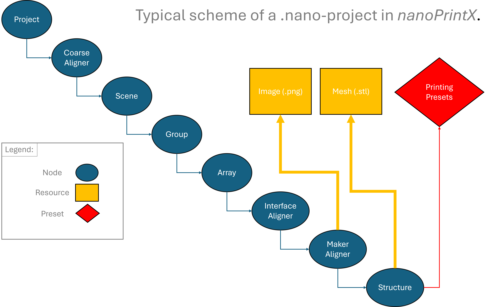
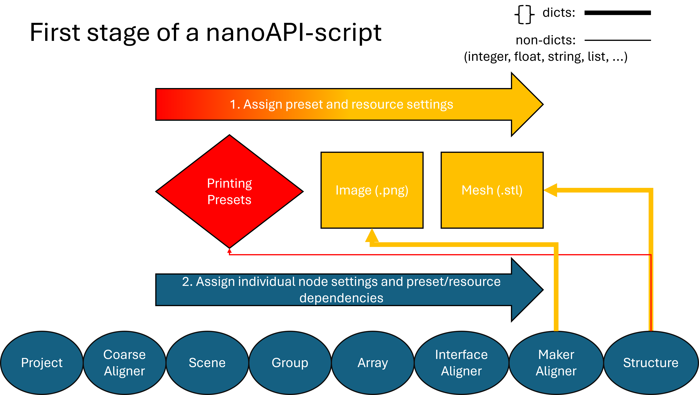
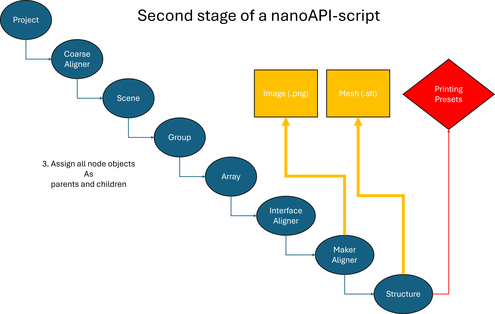
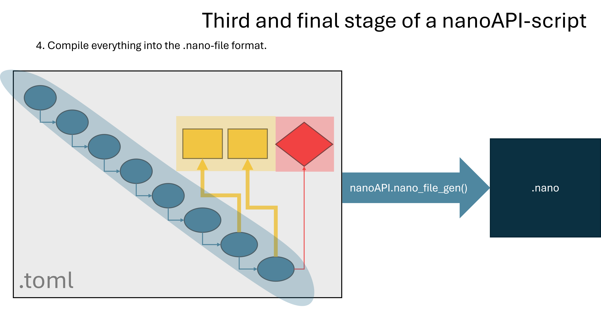
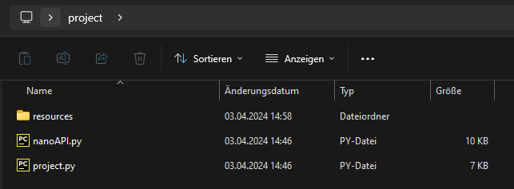
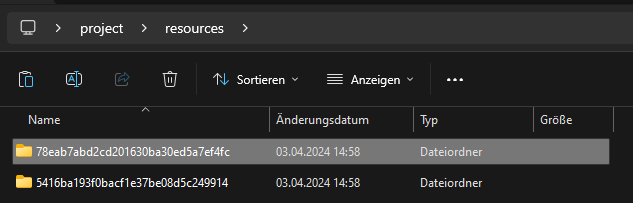

# nanoAPI
0.0.0-alpha

## Prerequisites
- Python 3
- Python-packages: `toml, uuid, json, subprocess, time, datetime, os, shutil, hashlib`
- [7-Zip](https://7-zip.org/)


## Setup
- Make sure you have all neccessary Python packages mentioned above installed.
- Install 7-Zip as provided by their official website (Linux-users might already have it by default).
- Windows only: Add the 7-Zip-directory in your environment variables settings to PATH.
- Download `nanoAPI.py` from the repository and make sure your `project.py`-files can import it.

## Introduction
The here provided custom API *nanoAPI* for the **Nanoscribe QX** attempts to emulate the logic of its out-of-the-box
GUI-software *nanoPrintX* by means of plain-text-manipulation and open-source-tools only. Just three classes are implemented to accomplish this
in a concise manner:

1. Presets: `nanoAPI.Preset()`
2. Resources: `nanoAPI.Resource()`
3. Nodes: `nanoAPI.Node()`

These three classes are the backbone of *nanoAPI* since they make up the main building blocks of how the .nano-files are structured.
In order to go through the functionalities of each class it is most reasonable to go through one example of how a .nano-file is created.
However, before doing so, a brief outline of the API's scripting logic is crucial since the rather abstract nature of plain-text
implementation of the intuitively clear and accessible GUI will inevitably have a more alien feel to it. Therefore, an illustrative
guide of the API's logic can help understanding the order of implementation before diving into the actual code for the .nano-generation. 

## Schematic Outline
**ATTENTION:** *It is assumed that the reader has already familiarized themselves with the nanoPrintX-GUI's workflow before proceeding with the following doc!*
*No additional introduction will be given for the GUI beforehand.*



Working with the GUI is straightforward and user friendly: You have your three tabs designated as 'Treeview', 'Presets', 'Resources' and the rest is
pretty much straightforward from there. You import your resources, i.e., images (`.png`)  and meshs (`.stl`), set your presets and then get started with
structuring your project by inserting your children-nodes to your main project-node and set your node settings on the fly (see Fig. 1).



The way of how *nanoAPI* handles things is quite similiar with the exception being that you can also define your nodes and set the node settings <ins>before</ins> you
assign them as parents or children (see Fig. 2). Breaking the workflow structure up like this not only gives the user the ability to have a more customized project workflow
but also to keep their code more readable by, as for instance, implementing the node allocation in a seperated code block.
The presets and resources, however, should always be defined from the outset in order to allocate them while setting up marker-aligner-nodes and/or
structure-nodes. Although syntactically inconvenient, there is propably no issue doing it otherwise. However, it is strongly suggested to define them always first for semantic reasons.

After having set up all nodes, one can start allocating them in their respective parent-child-order (see Fig. 3; Once again: It is possible to do this the
other way around here as well but it is probably easier in most situations to keep track of your code by sticking to the described structure here).



The last step is always the same, where all objects are collected according to their classed, preprocessed and wrapped up into the .nano-format (see Fig. 4). 



## Example Project

### Preparing your project
Before you start coding your `project.py`, you should prepare you project folder. This step is rather easy but there are some caveats that should be discussed.
Your project folder just needs to contain an additional folder named `resources` which contains your images (`.png`) and meshes (`.stl`). It should be clear that
the naming of those files should be unique because otherwise the **QX** would run into problems. *nanoPrintX* uses the MD5-hashes (see Fig. a/b) of the respective files and creates sub-folders
inside the `resources`-folder and inserts those files then into them. This way you end up with uniquely named folders that each stores the single respective file, serving
as labels. I have implemented a function called `copy_files_to_resource_directory(source_directory = 'my/resources/are/here')` which does this for you if you want to adapt
to this convention applied by *nanoPrintX*. However, as long as you have unique naming conventions, you can skip this extra step.




Thats already it! If you have these two things (and maybe also the `nanoAPI.py` as well, if you want to make things easy) you are good to go and start with the actual script!

### Code
**ATTENTION:** *It is extremely useful if you know how classes work in Python. We will not go into those details here since fundamental properties of classes are always the same.*
*It is recommended to check out some documentations in order to be able to fully exploit the functionalities provided when coding your routines!*

*If you want to know ahead what the output is going to look like, just run the `example_project.py` inside the `example`-folder and take a look at the `example_project.nano` via the GUI.*

First, we need to import all neccessary packages to our `project.py` and define a dictionary that contains some meta data about our project. 

```python
import nanoAPI as n
from datetime import datetime
import os

project_info_json = {
                      "author": "cuenlueer",
                      "objective": "25x",
                      "resist": "IP-n162",
                      "substrate": "FuSi",
                      "creation_date": datetime.now().replace(microsecond=0).isoformat()
                    }


```
This structure is the basis header and every project should contain this header. Just don't forget to adjust the dictionary (dict) according to your project demands.
If you should wonder why this dict exists, do not. It is just something that the `.nano`-file will need to function properly. Just treat it like some sort of header/label
and do not think too much about it.

The next step is to take care of your presets and resources. Name your preset and provide the neccessary parameters as shown below by passing them as a dict.
```python
edit_presets = {
                "writing_speed" : 250000.0,
                "writing_power" : 50.0,
                "slicing_spacing" : 0.8,
                "hatching_spacing" : 0.3,
                "hatching_angle" : 0.0,
                "hatching_angle_increment" : 0.0,
                "hatching_offset" : 0.0,
                "hatching_offset_increment" : 0.0,
                "hatching_back_n_forth" : True,
                "mesh_z_offset" : 0.0
               }

preset = n.Preset(name = "25x_IP-n162_anchorage_FuSi_clone", **edit_presets)

```
The parameters are the same you would also encounter when you open the respective menu in the GUI.

We now proceed with allocation of our resources: namely our mesh structure and marker image.
```python


resource_mesh = n.Resource(resource_type = "mesh_file",
                           name = "structure",
                           path = "5416ba193f0bacf1e37be08d5c249914/combined_file.stl")

resource_image = n.Resource(resource_type = "image_file",
                            name = "markers_1",
                            path = "78eab7abd2cd201630ba30ed5a7ef4fc/markers.png")

```
There are no other resource types other then these two. The names you choose as you wish. The path is the location inside of the `resources`-folder and as you can see
here, the (very esthetically pleasing) MD5-hash-convention, as used by *nanoPrintX*, was (demonstratively) used.

Now we get to the allocation of nodes. As always, we start by setting up the project node.
```python

project = n.Node(node_type='project',
                 name = 'Project 1',
                 objective = project_info_json['objective'],
                 resin = project_info_json['resist'],
                 substrate = project_info_json['substrate'])


```
Here, the most important options were fetched from `project_info_json`-dict above. This way, you can technically treat this node also as a 'reusable' header element.

Now proceed with setting up your coarse aligner.
```python
coarse_aligner1 = n.Node(node_type = 'coarse_alignment',
                        name = "Coarse aligner 1",
                        residual_threshold = 10.0,
                        orthonormalize = True # here-to-stay value: This means that I just do not know if you can leave this out or not since
                        )                     # it appears in the 'source code' but not the GUI as an adjustable setting. Just mess around (i.e., leave it out) and find out!
labels = ['anchor 0',
          'anchor 1',
          'anchor 2',
          'anchor 3']

positions = [[-60.0, -528.0, 0.0],
             [-130.0, -528.0, 0.0],
             [-60.0, 20.0, 0.0],
             [-130.0, 20.0, 0.0]]

for label, position in zip(labels,positions):
    coarse_aligner1.add_coarse_anchor(label, position)
```
The node's type gets allocated as a coarse aligner with some arbitrary name. All default options as provided by *nanoPrintX* are already passed if not declared otherwise.
In the next lines the labels and positions for the coarse aligner's anchors need to be set. You pass those by utilizing the `Node`-classes method `.add_coarse_anchor(label, position)`.

Demonstratively we add nodes of types scene, group and array.
```python
scene1 = n.Node(node_type = 'scene',
                name = 'Scene 1',
                writing_direction_upward = True)
#-----------------------------------------------
group1 = n.Node(node_type = 'group',
                name = 'Group 1')
#-----------------------------------------------
array1 = n.Node(node_type = 'array',
                name = 'Array 1')
#-----------------------------------------------
```
All of them, if not specified otherwise, will maintain their default arguments as they would if you would just add them in the GUI.

Now for the node allocated as an interface aligner, we see something syntactically important.
```python
interface_aligner1 = n.Node(node_type = 'interface_alignment',
                            name = 'Interface aligner 1',
                            action_upon_failure = "abort",
                            properties = {"signal_type": "fluorescence"},
                            pattern = "Custom",
                            measure_tilt = True) 

labels = ['marker 0',
          'marker 1',
          'marker 2',
          'marker 3',
          'marker 4',
          'marker 5',
          'marker 6',
          'marker 7']

positions = [[-130.0, -30.0],
             [-130.0, 30.0],
             [-60.0, -30.0],
             [-60.0, 30.0],
             [-130.0, -60.0],
             [-130.0, 60.0],
             [-60.0, -60.0],
             [-60.0, 60.0]]

scan_area_sizes = [[10.0,10.0],
                   [10.0,10.0],
                   [10.0,10.0],
                   [10.0,10.0],
                   [10.0,10.0],
                   [10.0,10.0],
                   [10.0,10.0],
                   [10.0,10.0]]

for label, position, scan_area_size in zip(labels, positions, scan_area_sizes):
    interface_aligner1.add_interface_anchor(label, position, scan_area_size)

```
There is this argument called `properties` that is <ins>always</ins> a dict! So any arguments that are part of the properties-section inside the GUI have to be passed as 
a dict! The same is true for two more arguments: `marker` and `geometry`. The anchors are here once again assigned via a method (`.add_interface_anchor(label, position, scan_area_size)`) 
as before in the case with the coarse alignment.

We now arrive at the marker aligner, which is the first node that needs an external resource assigned.
```python
marker_aligner_default = {
                          "scan_area_res_factors" : [2,2],
                          "laser_power" : 0.5,
                          "detection_margin" : 5.0,
                          "correlation_threshold" : 60.0,
                          "residual_threshold" : 0.5,
                          "max_outliers" : 0,
                          "orthonormalize" : True,
                          "z_scan_sample_count" : 1,
                          "z_scan_sample_distance" : 0.5,
                          "z_scan_optimization_mode" : "correlation",
                          "measure_z" : False,
                         }

marker_dict = {
    "image": resource_image.id,
    "size": [5.0,5.0]
    }

marker_aligner1 = n.Node(node_type = "marker_alignment",
                         name = "Marker aligner 1",
                         marker = marker_dict,
                         **marker_aligner_default)

labels = ['marker 0',
          'marker 1',
          'marker 2',
          'marker 3']

positions = [[-60.0, -20.0, 0.0],
             [-130.0, -20.0, 0.0],
             [-60.0, 20.0, 0.0],
             [-130.0, 20.0, 0.0]]

rotations = [0.0,
             0.0,
             0.0,
             0.0]

for label, position, rotation in zip(labels, positions, rotations):
    marker_aligner1.add_marker_anchor(label, position, rotation)
```
The dict `marker_aligner_default` once again contains the known settings from the GUI as well as the dict `marker_dict` does. However, the latter one gets passed to the node as a dict 
(i.e., is not unpacked by `**`) to the `marker`-argument and it contains information about what marker, i.e., `Resource`-object, is going to be used and its desired size. 
It is also important to note how the assignment works: The `Resource`-object does not get allocated itself but rather its attribute `Resource.id`. All the introduced classes 
get an ID assigned automatically when instantiated. The ID has no meaning to you as a user but serves as a unique identifier so that assignment of nodes is independent from their manual 
labeling/naming. In the case of the here discussed node `marker_aligner1` the corresponding marker is now allocated to it via the marker's ID in `marker_dict`, passed as the `marker`-argument. 
Furthermore, the allocation of marker anchors is analogous to the former cases of interface and coarse aligners via a method (here `.add_marker_anchor(label, position, rotation)`-method).

Last but not least, we arrive at the last node in our project, namely a `structure`-node. Here, we encounter the third dict-type argument called `geometry` that is quite similar to what we saw 
earlier in the case of the `marker`-argument. It should also be clear by now that these dict-arguments correspond in the GUI to the 'seperate windows' in the respective setting sections.
```python
geometry_dict = {
     "type" : "mesh",
     "resource" : resource_mesh.id,
     "scale" : [1.0,1.0,1.0]
    }

structure1 = n.Node(node_type = "structure",
                    name = "test",
                    preset = preset.id,
                    slicing_origin_reference = "scene_bottom",
                    slicing_offset = 0.0,
                    priority = 0,
                    expose_individually = False,
                    geometry = geometry_dict)


```
Besides the ID allocated in the `geometry_dict`, the preset allocation for `structure1` is also done by passing the `preset`-node's ID. All other specifications are as always deduciable from 
the GUI. All in all, the way of how nodes are set up follows a fixed scheme that is similiar for all.

So far, we just did node preparation without specifying the parent-child-allocation.
```python
project.add_child(coarse_aligner1)
coarse_aligner1.add_child(scene1)
scene1.add_child(group1)
group1.add_child(array1)
array1.add_child(interface_aligner1)
interface_aligner1.add_child(marker_aligner1)
marker_aligner1.add_child(structure1)

```
As you can see, the parent-child-allocation is straightforwardly done by using the `.add_child(child_node)`-method. The parent-child-relation information will be stored in the class attribute `children`.

At last, all the presets, resources and nodes need to be compiled and wrapped into the `.nano`-file.
```python

presets_list = [preset]
resources_list = [resource_mesh,
                  resource_image]
nodes_list = [project,
              coarse_aligner1,
              scene1, group1,
              array1,
              interface_aligner1,
              marker_aligner1,
              structure1]


n.save_to_toml(presets_list,
               resources_list,
               nodes_list)

n.project_info(project_info_json)

n.nano_file_gen(project_name = 'project_example')

```
This procedure is always the same. At the end you will get your `.nano`-file generated in you project folder and you will be good to go: 
1. Sort all class objects according to their types (`Preset`,`Resource`,`Node`) into lists as above.
2. Pass those lists as arguments to `save_to_toml(presets, resources, nodes)`.
3. Pass the dict `project_info_json` to `project_info(project_info_json)`.
4. Pass your projects (file-)name as a string to `nano_file_gen(project_name)`.
Technically, the third step could be done right at the begining after defining `project_info_json`. However, this was not done here due to semantic reasons that are supposed to emphasize the importance 
of that very dict for the `.nano`-file generation.

It is obvious that this little introduction cannot replace a fully fletched documentation. However, something like that would take much more time and will therefore be provided
in the future bit by bit. Hopefully, this example will for now be somewhat sufficient to give you a starting point. If there should be still any confusion or problems, please
do not hesitate to contact me and I will help!

## Misc
*This section contains things like remarks or pro tips, which might be useful to know but not neccessarily mandatory for understanding how to use nanoAPI.*
- You might have seen that there are a lot of lists, dicts, lists in lists and so on, that are used to store information about settings, markers, and so on. It is therefore 
convenient to store all that info in a `.csv`- or `xlsx`-format that makes them easily adjustable and readable for humans. An extremely useful package to load and manage
such files in an python-environment is the package `pandas`. Familirizing yourself with it and utilizing it will definetively be a valuable contribution to your workflow!
- You will not be able to tell if your `.nano`-file gets executed in the **QX** or not by just compiling your project. As of yet, *nanoAPI* does not output any errors if there is 
something wrong with your project. Therefore, it makes sense to check if *nanoPrintX* loads the project properly. If it does, it means that your project will be accepted by the **QX**. 
If you want to be on the safe side, you can also save (pun unintended) your file after opening it in *nanoPrintX*.
- As of yet, there is no way of telling what parameters are mandatory for the `.nano`-files to work. Some parameters do appear to be redundant 
inside the `.nano`-files and are going to be commented with `#here-to-stay value` or `#hts value` inside the `example_project.py`. Those are never assigned in the  GUI but appear anyway. 
The user is therefore hereby encouraged to just experiment with leaving out some of those parameters and check if the project files still work.

## License

This project is licensed under the GNU Lesser General Public License v3.0 (LGPL-3.0) - see the [LICENSE](https://github.com/cuenlueer/nanoAPI/blob/main/LICENSE) file for details.
### What This Means for Users and Contributors

- **Freedom to Use:** You are free to use this software in your projects, commercial or otherwise, as long as you comply with the LGPL-3.0 terms.

- **Modifying the Library:** If you modify this library, you must distribute your modifications under the same LGPL-3.0 license. Your modifications must be documented, and the modified library must be available for users to access, use, and link against.

- **Linking to Proprietary Code:** You can link this library with proprietary code, forming a combined work. The proprietary code will not be subject to the terms of LGPL, provided the LGPL library is not modified and is used as a dynamically linked module.

- **Contribution and Distribution:** If you contribute to this project, your contributions will be under the same LGPL-3.0 license. If you distribute this library, either in original or modified form, you must do so under the LGPL-3.0, ensuring that recipients have access to the source code of the library and the rights to modify it.

For more details on your rights and responsibilities under this license, please review the [LICENSE](https://github.com/cuenlueer/nanoAPI/blob/main/LICENSE) file.
