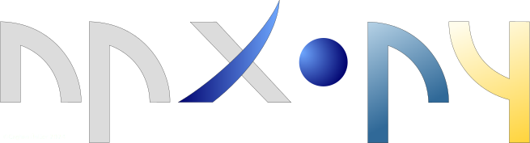

# npxpy

npxpy is a versatile open source Python package that enables you to build projects (NANO files) for the 3D direct laser 
lithography system **Nanoscribe Quantum X align** (**QXa**) via CLI/Scripts. It is designed such that it adheres to the
same workflow logic as Nanoscribe's GUI software *nanoPrintX*, making the application additionally user-friendly to
experienced users of the **QXa**.

## Table of Contents
- [Installation](#installation)
- [Features and Usage](#usageandfeatures)
- [Documentation](#documentation)
- [How to Cite npxpy](#howtocitenpxpy)
- [License](#license)

## Installation
It is recommended to install ```npxpy``` in a virtual environment to prevent dependency issues.\
You can install ```npxpy``` via ```pip``` together with all features (recommended) :
```
pip install npxpy[all]
```
If you are interested in a light-weight installation you are able to install only the core of ```npxpy``` via:
```
pip install npxpy
```
Beware that the light-weight installation lacks features like the 3D-viewport or GDS-parsing.

## Features and Usage
npxpy comes implemented with all core elements known from *nanoPrintX*:

- **Presets**
- **Resources**
  - Images
  - Meshes
- **Nodes**
  - **Spacial nodes:** 
    - Scene
    - Group
    - Array
  - **Structure nodes:** 
    - Structure
    - Text
    - Lens
  - **Aligner nodes:**
    - Coarse aligner
    - Interface aligner
    - Fiber aligner
    - Marker aligner
    - Edge aligner
  - **Miscellaneous nodes:**
    - Dose compensation
    - Capture
    - Stage move
    - Wait

A simple example for a project can look like the one below.

```python
import npxpy

#  Initialize the presets and resources that you want to use in this project.
#  You can either load presets directly from a .toml...
preset_from_file = npxpy.Preset.load_single(file_path = 'preset_from_file.toml')

#  ... or initialize it inside of your script.
edit_presets = {"writing_speed" : 220000.0,
                "writing_power" : 50.0,
                "slicing_spacing" : 0.8,
                "hatching_spacing" : 0.3,
                "hatching_angle" : 0.0,
                "hatching_angle_increment" : 0.0,
                "hatching_offset" : 0.0,
                "hatching_offset_increment" : 0.0,
                "hatching_back_n_forth" : True,
                "mesh_z_offset" : 0.0}

preset_from_args = npxpy.Preset(name = 'preset_from_args', **edit_presets)

#  Load your resources simply via path to their directories. 
stl_mesh = npxpy.Mesh(file_path = './example_mesh.stl', name = 'stl_structure_0')
marker = npxpy.Image(file_path = './example_marker.png', name = 'marker_image')

#  Initialize your project and load your presets and resources into it.
project = npxpy.Project(objective = '25x', resin = 'IP-n162', substrate = 'FuSi')
project.load_presets([preset_from_file, preset_from_args])
project.load_resources([stl_mesh, marker])

#  Prepare the nodes of your project as you would in nanoPrintX-Treeview.
#  Starting with the coarse aligner.
coarse_aligner = npxpy.CoarseAligner(residual_threshold = 8)

ca_labels = ['anchor 0',
          'anchor 1',
          'anchor 2',
          'anchor 3']
ca_positions = [[200.0, 200.0, 0.0],
             [200.0, -200.0, 0.0],
             [-200.0, -200.0, 0.0],
             [-200.0, 200.0, 0.0]]

coarse_aligner.set_coarse_anchors_at(ca_labels, ca_positions)

#  Initializing printing scene
scene_0 = npxpy.Scene(name = 'scene_0', writing_direction_upward=True)

#  Interface alignment
interface_aligner = npxpy.InterfaceAligner(name = 'Interface Aligner')

ia_labels = ['marker 0',
          'marker 1',
          'marker 2',
          'marker 3',
          'marker 4',
          'marker 5',
          'marker 6',
          'marker 7']

ia_positions = [[-130.0, -30.0],
             [-130.0, 30.0],
             [-60.0, -30.0],
             [-60.0, 30.0],
             [-130.0, -60.0],
             [-130.0, 60.0],
             [-60.0, -60.0],
             [-60.0, 60.0]]

interface_aligner.set_interface_anchors_at(ia_labels, ia_positions)

#  Marker alignment
marker_aligner = npxpy.MarkerAligner(name = 'Marker Aligner',
                                     image = marker, marker_size=[10,10])

#  Initialize structure with desired preset and mesh defined above.
structure_0 = npxpy.Structure(name = 'structure_0', 
                              preset = preset_from_file, mesh = stl_mesh)

#  Arrange hierarchy of all nodes as desired either with .add_child()...
coarse_aligner.add_child(scene_0)
scene_0.add_child(interface_aligner)

#  ...or more conveniently by using .append_node() to append
#  directly to the lowest node.
scene_0.append_node(marker_aligner)
#
scene_0.append_node(structure_0)

#  Eventually, add all highest-order nodes of interest
#  (here only coarse_aligner) to project.
project.add_child(coarse_aligner)

#  After allocating your nodes, you can copy, manipulate and add additional
#  instances as you like.
scene_1 = scene_0.deepcopy_node(copy_children = True)
scene_1.name = 'scene_1'
scene_1.position = [254, 300, 0]

#  You can access descendants/ancestors as you go via semantically ordered lists.
structure_1 = scene_1.all_descendants[-1]
structure_1.preset = preset_from_args
structure_1.name = 'structure_1'

coarse_aligner.add_child(scene_1)

#  Export your project to a .nano-file.
project.nano(project_name = 'my_project')
```
Features like a CLI-treeview are also available for keeping track of your project even without an external
GUI!
```python
In: project.tree()
Out: Project (project)
        └──Coarse aligner (coarse_alignment)
            ├──scene_0 (scene)
            │   └──Interface Aligner (interface_alignment)
            │       └──Marker Aligner (marker_alignment)
            │           └──structure_0 (structure)
            └──scene_1 (scene)
                └──Interface Aligner (interface_alignment)
                    └──Marker Aligner (marker_alignment)
                        └──structure_1 (structure)

In:  scene_0.tree()
Out: scene_0 (scene)
        └──Interface Aligner (interface_alignment)
            └──Marker Aligner (marker_alignment)
                └──structure_0 (structure)
```
## [Documentation](heregoesthelink!)
To view more functionalities and use case examples of npxpy, refer to the the provided [documentation](heregoesthelink!).

## License

This project is licensed under the MIT License - see the [LICENSE](https://github.com/cuenlueer/nanoAPI/blob/main/LICENSE)
file for details.\
**TL;DR:** You may use, modify, and distribute this software freely, provided the license and copyright notice are included.
### What This Means for Users and Contributors

- **Freedom to Use:** You are free to use this software in any project (commercial, personal, or otherwise) without
restrictions, as long as the MIT License terms are met.

- **Modifications and Derivatives:** You may modify the code, create derivative works, and distribute them under any
license of your choice. The only requirements are:
  - Include the original MIT License and copyright notice with your distribution.
  - Clearly state any significant changes made to the original code.
- **Linking and Distribution:** You may link this software with proprietary code or other open-source projects without
restrictions. No obligations apply to the proprietary components of your project.

- **Contribution:** By contributing to this project, you agree that your contributions will be licensed under the
MIT License. This ensures your changes remain freely usable by others under the same terms.

For more details on your rights and responsibilities under this license, please review the [LICENSE](https://github.com/cuenlueer/nanoAPI/blob/main/LICENSE) file.
